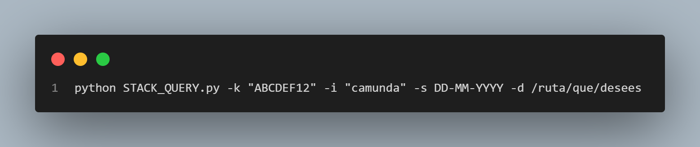

# INFORMACIÓN DEL PROGRAMA
***Nombre:*** STACK_QUERY 
***Descripción:*** programa que obtiene discusiones de StackOverflow sobre cualquier tema realizando unas validaciones puntuales de acuerdo a los requerimientos. 
***Desarrollado por:*** DANNO_NZ 
***API:*** https://stackapps.com/apps/oauth/view/26090

# Para ejecutar el programa se necesita:

1. Realizar el registro en https://stackapps.com/users/login (si ya tiene la API omita este paso).
2. Registrar la aplicación para obtener las credenciales que permiten usar la API de StackOverflow https://stackapps.com/apps/oauth/register (si ya tiene la API omita este paso)
3. Obtener un cliente ID y una clave secreta de autenticación OAuth en Stack Overflow (si ya tiene la API omita este paso)
3. Instalar un editor de código, recomendado Visual Studio Code (VSCODE): https://code.visualstudio.com/download
4. Instalar el manejador de versiones GIT https://git-scm.com/downloads 
5. Clonar el repositorio con el comando: git clone https://github.com/danilonunezgil/BPM_PC_S.git
6. Instalar Python en cualquier versión https://www.python.org/downloads/ o instalar la extensión a VSCODE
7. Instalar los siguientes módulos:

   pip install requests (para hacer solicitudes HTTP) 
   pip install psycopg2-binary (para conectarse y realizar operaciones con PostgreSQL)
   
8. Instalar PostgreSQL https://www.postgresql.org/download/windows/ (versión estable o última versión)
9. Con la ayuda de pgAdmin 4, crear una base de datos llamada BPM_PC_QUERY 
10. En esa misma BD, mediante el uso del script llamado BPM_PC_Query.sql crear la siguiente tabla:
   
   CREATE TABLE BPM_PC_QUERY ( 
      id_discussion SERIAL PRIMARY KEY, 
      topic VARCHAR(25), 
      title VARCHAR(255), 
      link VARCHAR(255), 
      score INTEGER, 
      answer_count INTEGER, 
      view_count INTEGER, 
      creation_date DATE, 
      tags VARCHAR(255) 
   ); 
   
11. Ejecuta el programa mediante la siguiente instrucción en la terminal:

   
   Ejemplo:  python BPM_PC_QUERY.py -k "ABCDEF12" -i "camunda" -d "STACK_QUERY" -u "admin" -p "12345" -f DD-MM-YYYY

12. Si no hay errores, los datos serán guardados descartando aquellas discusiones que tengan votos negativos (menores que cero). El programa realiza una validación de la existencia de una discusión y la omite si esta ya se encuentra en la base de datos. Para verificar los datos ejecute la sentencia SQL en pgAdmin 4:

SELECT * FROM DB_name WHERE title ILIKE '%search_name%';

# Resumen del Desarrollo: 
El presente programa encarga de utilizar una API de StackOverflow para obtener preguntas relacionadas a un título de búsqueda especificado. Luego, almacena estas preguntas en una base de datos local utilizando PostgreSQL. El programa verifica si cada pregunta ya existe en la base de datos y, si no es así y tiene un puntaje mayor o igual a cero, la inserta. Al final, se muestran estadísticas sobre el número de preguntas encontradas, insertadas, omitidas por votos negativos y omitidas por existir previamente en la base de datos.

La base de datos almancena los siguientes atributos de cada discusión:

| Atributo | Description |
| --- | --- |
| id_discussion | Identificador único de la discusión |
| title | Título de la discusión |
| link | Enlace a sitio web StackOverflow de la discusión |
| score | Puntaje que tiene la discusión |
| answer_count | Número de respuestas que tiene la discusión |
| view_count | Número de vistas que tiene la discusión |
| creation_date | Fecha de creación de la discusión |
| tags | Etiquetas relacionadas a la discusión |

El desarrollo en cuestión se centra en buscar discusiones dentro de StackOverflow cuyos títulos contengan la plataforma específica que se solicitó por parámetro. Esto se debe a que, en ocasiones, los datos proporcionados por la API no están completamente contextualizados en relación con la plataforma objetivo si se realiza la búsqueda de la plataforma específica tanto en el cuerpo de la discusión como en sus respuestas. 

# Limitaciones del uso de la API:
https://api.stackexchange.com/docs/throttle 
Máximo 30 peticiones por segundo 
Máximo 10.000 peticiones por día 
En caso de superar la máximas por día, saldrá un error HTTP 429. 
Dado el caso se haya superado el límite diario de peticiones al servidor se renovarán las 10.000 peticiones a partir de la media noche siguiente.

# Mejoras futuras:
Implementar una base de datos en la nube. 
Actualización registro a registro o registro puntual. 
